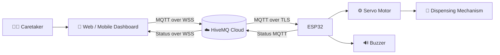
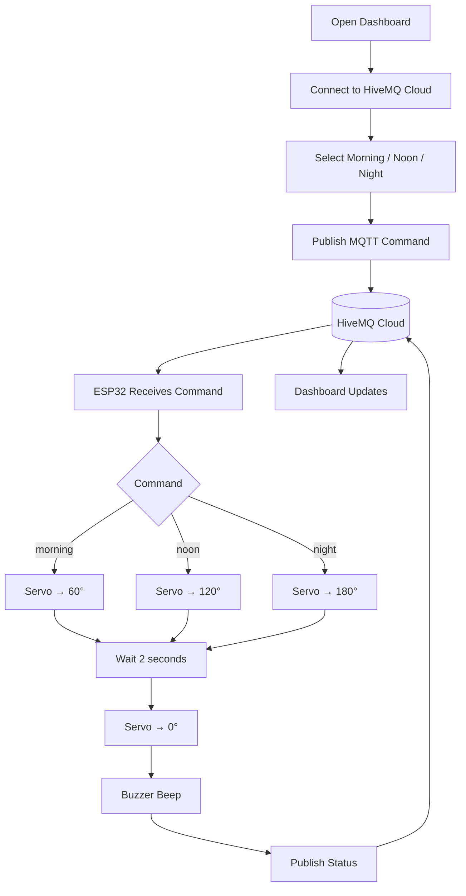
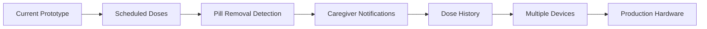

# 💊 PillDispenser

### Internet-Connected Smart Medicine Dispenser Prototype

PillDispenser is an ESP32-based connected medicine dispenser prototype designed to let a caretaker remotely trigger one of three physical medicine positions.

The system uses **MQTT + HiveMQ Cloud** as the communication layer, allowing the control interface and physical dispenser to operate on different networks.

> **Prototype status:** Working proof of concept. Not a certified medical device.

---

## 🚀 What We Are Building

The core idea is simple:

**Caretaker selects a dose → cloud carries the command → ESP32 receives it → servo moves → medicine is dispensed → buzzer confirms → ESP32 reports the event back.**

| Dose | Servo Position | MQTT Command |
|---|---:|---|
| 🌅 Morning | 60° | `morning` |
| ☀️ Noon | 120° | `noon` |
| 🌙 Night | 180° | `night` |

After two seconds at the selected position, the servo returns to `0°` and the buzzer gives a short confirmation beep.

---

## 🧠 System Architecture



The cloud broker acts as the bridge between the user interface and the physical dispenser.

This means the phone does **not** need to directly connect to the ESP32's local IP address.

---

## 🌐 Why MQTT Instead of Direct HTTP?

The first version of the project used a local HTTP dashboard:

```text
Browser
   │
   │ HTTP
   ▼
ESP32 local IP
```

That architecture depended on the browser and ESP32 being reachable on the same local network.

The current architecture is:

```text
Phone / PC
     │
     │ Secure WebSocket
     ▼
HiveMQ Cloud
     │
     │ Secure MQTT
     ▼
   ESP32
```

Therefore:

- Phone can use mobile data.
- ESP32 can use another Wi-Fi network.
- Neither device needs to know the other's IP address.
- The MQTT broker handles message routing.

---

## 🔄 Complete Dispensing Workflow



---

## 📡 MQTT Topic Structure

The project uses a simple device-specific topic hierarchy:

```text
pillbox/
└── pillbox01/
    ├── cmd       ← Dashboard → ESP32
    └── status    ← ESP32 → Dashboard
```

### Command topic

```text
pillbox/pillbox01/cmd
```

Payloads:

```text
morning
noon
night
```

### Status topic

```text
pillbox/pillbox01/status
```

Example:

```json
{"dispensed":"morning"}
```

---

## ⚙️ Hardware

| Component | Connection |
|---|---|
| ESP32 | Main controller |
| Servo motor | Signal → GPIO 18 |
| Buzzer | Signal → GPIO 19 |
| Servo power | External appropriate 5V supply recommended |
| Common ground | Servo GND ↔ ESP32 GND |
| USB | ESP32 power/programming |

### Important power note

A typical servo should **not** be powered from the ESP32's 3.3V pin. Use an appropriate external power supply and connect the external supply ground to ESP32 ground.

---

## 🧩 Firmware Flow

```text
              ┌───────────────┐
              │   ESP32 Boot  │
              └───────┬───────┘
                      ▼
              ┌───────────────┐
              │ Connect Wi-Fi │
              └───────┬───────┘
                      ▼
             ┌────────────────┐
             │ Connect MQTT   │
             │ HiveMQ / TLS   │
             └───────┬────────┘
                     ▼
             ┌────────────────┐
             │ Subscribe CMD  │
             └───────┬────────┘
                     ▼
              ┌──────────────┐
              │ Wait command │◄─────────────┐
              └──────┬───────┘              │
                     ▼                      │
             ┌───────────────┐              │
             │ Select angle  │              │
             └───────┬───────┘              │
                     ▼                      │
              Servo movement                │
                     ▼                      │
                Wait 2 sec                  │
                     ▼                      │
                Return 0°                   │
                     ▼                      │
                Beep buzzer                 │
                     ▼                      │
              Publish status ───────────────┘
```

---

## 🛠️ Software Stack

### Embedded

- ESP32
- Arduino IDE
- C++ / Arduino framework
- PubSubClient
- ESP32Servo
- Wi-Fi
- MQTT over TLS

### Cloud

- HiveMQ Cloud
- MQTT
- Secure WebSockets for browser/mobile clients

### Interfaces

- Standalone HTML dashboard
- React Native / Expo mobile application planned/in development

---

## 📁 Repository Structure

```text
PillDispenser/
│
├── README.md
│
├── arduino/
│   └── PillDispenser_MQTT.ino
│
├── web/
│   └── index.html
│
├── docs/
│   └── wiring.md
│
└── assets/
    └── README.md
```

Photos, prototype photographs, diagrams and demonstration media can be added under `assets/` later.

---

## 🔌 Arduino Libraries

Install these libraries through Arduino IDE Library Manager:

- **PubSubClient** by Nick O'Leary
- **ESP32Servo**

The firmware uses:

```cpp
#include <WiFi.h>
#include <WiFiClientSecure.h>
#include <PubSubClient.h>
#include <ESP32Servo.h>
```

---

## 🔐 HiveMQ Configuration

The ESP32 requires:

```text
MQTT Host       = YOUR_CLUSTER.hivemq.cloud
MQTT Port       = 8883
MQTT Username   = YOUR_USERNAME
MQTT Password   = YOUR_PASSWORD
```

The web/mobile client connects through secure WebSockets, typically:

```text
wss://YOUR_CLUSTER.hivemq.cloud:8884/mqtt
```

### ⚠️ Never commit credentials

Do not put real MQTT usernames/passwords into a public GitHub repository.

Use placeholders such as:

```cpp
const char* mqtt_username = "YOUR_MQTT_USERNAME";
const char* mqtt_password = "YOUR_MQTT_PASSWORD";
```

---

## 🧪 Testing

### Test 1 — Morning

Publish:

```text
morning
```

Expected:

```text
Servo → 60°
Wait 2 seconds
Servo → 0°
Buzzer → 200 ms
Status → {"dispensed":"morning"}
```

### Test 2 — Noon

```text
noon
```

Expected:

```text
0° → 120° → 0°
```

### Test 3 — Night

```text
night
```

Expected:

```text
0° → 180° → 0°
```

---

## 📌 Current Prototype Scope

The current version focuses on the connected actuation pipeline:

- Manual remote triggering
- Three dispensing positions
- ESP32 control
- Servo actuation
- Buzzer confirmation
- MQTT cloud communication
- Status reporting

### Important distinction

The current prototype does **not** have an IR/optical pill-consumption sensor.

Therefore:

> `dispensed` means that the requested dispensing action was executed. It does **not** prove that the patient actually consumed the medicine.

---

## 🚧 Future Roadmap



Planned improvements include:

- Scheduled medication reminders
- Medicine names and dosage configuration
- Pill-removal detection
- Missed-dose detection
- Caregiver push notifications
- Dose history and audit logs
- Multiple compartments
- Multiple dispenser devices
- Device health monitoring
- Battery monitoring
- Offline/fail-safe behavior
- Secure per-device credentials
- Firebase/database integration
- React Native caregiver application
- Custom PCB
- Improved mechanical single-pill dispensing mechanism
- Enclosure and manufacturable hardware

---

## 🔒 Security Considerations

The prototype may use:

```cpp
espClient.setInsecure();
```

during development.

This provides an encrypted TLS connection but disables certificate verification. A production implementation should instead use proper CA certificate validation, unique device credentials, access control, secure secret storage and appropriate failure handling.

---

## 🏥 Prototype Disclaimer

PillDispenser is an engineering prototype and is **not a certified medical device**.

It must not be relied upon for unsupervised or safety-critical medication administration. Mechanical reliability, electrical safety, software reliability, authentication, fail-safe behavior and applicable regulatory requirements must be validated before real-world clinical use.

---

## 🎯 Project Vision

The long-term goal is to turn the prototype into a reliable connected medication-management system where:

```text
             CARETAKER
                 │
                 ▼
          MOBILE / WEB APP
                 │
                 ▼
            MQTT CLOUD
                 │
                 ▼
               ESP32
                 │
          ┌──────┴──────┐
          ▼             ▼
       SERVO          BUZZER
          │
          ▼
    💊 MEDICINE DOSE
          │
          ▼
       STATUS
          │
          └──────────────→ CARETAKER
```

The objective is not simply to move a servo remotely, but to build the foundation for a **connected, observable and eventually intelligent medication-dispensing platform**.
